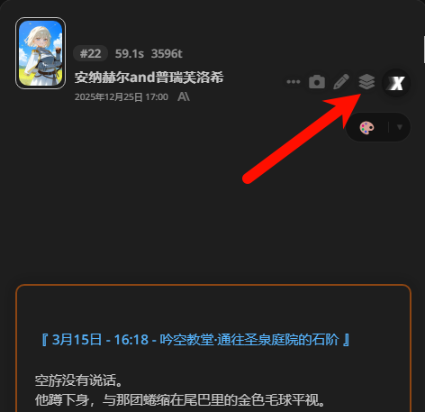
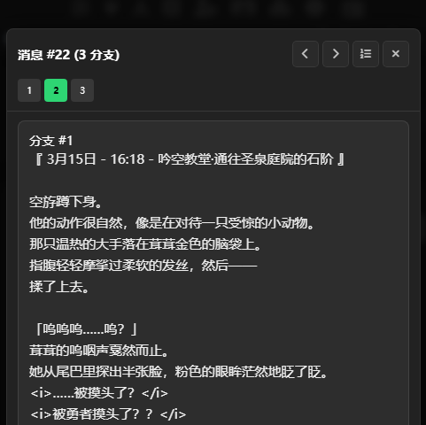

# SillyTavern分支预览器 (SillyTavern Swipe Previewer)

一个为 SillyTavern 开发的扩展插件，允许用户预览历史楼层中 AI 生成的所有回复分支（Swipes），而无需改变当前选中的内容。

## 功能特性

- **多楼层支持**：在聊天界面的每一条消息上添加预览按钮。
- **全部分支预览**：一键查看该轮次 AI 生成过的所有候选回复。
- **导航系统**：
  - **快速跳转列表**：顶部的数字列表可直接定位到特定分支。
  - **上下翻页**：使用箭头按钮顺序切换查看。
  - **列表折叠**：点击 `123` 图标可展开或收起跳转列表，节省空间。

- **纯预览模式**：预览操作不会改变当前聊天的实际选中分支，安全可靠。

## 安装方法

1. **前置插件**：必须安装并启用 `st-api-wrapper` 酒馆插件。
```
https://github.com/Lianues/st-api-wrapper
```
2. 安装本酒馆扩展 SillyTavern Swipe Previewer
```
https://github.com/qianzhuowo/SillyTavernSwipePreviewer
```

3. 刷新 SillyTavern 页面。

## 使用说明

1. 在任意一条 AI 发送的消息上，找到并点击新增的“图层”图标（位于编辑按钮附近）。
  
  

2. 在弹出的窗口中：
   - 使用顶部的数字列表快速跳转。
   - 使用左/右箭头按钮翻页。
   - 点击 `123` 图标折叠列表。
   - 绿色边框标记的内容为当前聊天中实际选中的分支。

## 注意事项

- 本插件需要 `st-api-wrapper` 提供的底层接口支持。
- 如果某条消息只有一个分支，点击按钮会提示无需预览。
